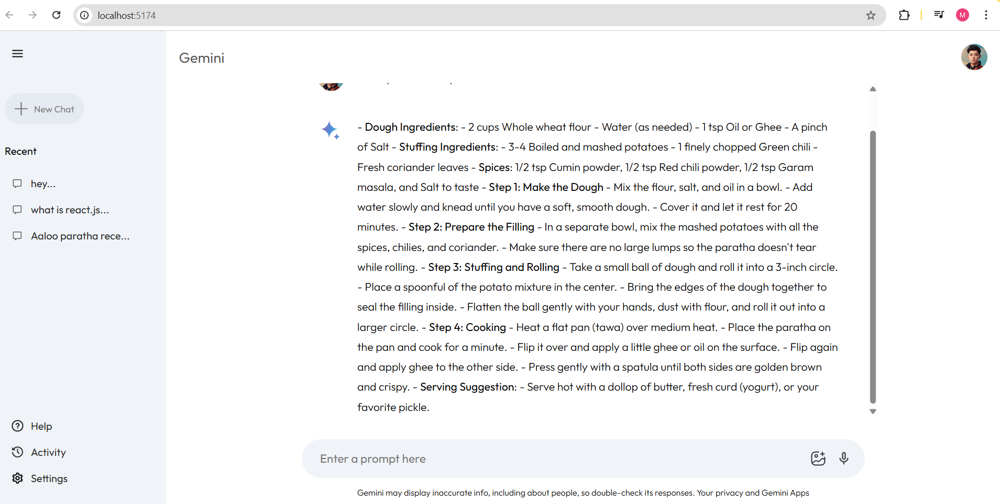
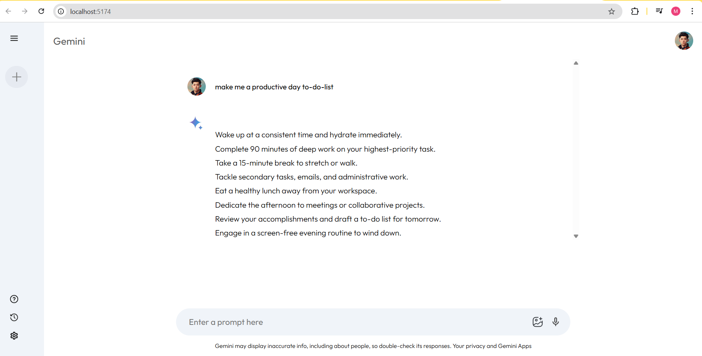

<div align="center">

<!-- Header with gradient text effect -->


<br/>
<!-- Stylish tech stack badges -->


<br/><br/>

</div>

---

<div align="center">

## 📖 PROJECT SUMMARY

A modern, sleek Gemini AI chat interface built with React and Vite. This clone brings the power of Google's Gemini AI to life with a beautiful, responsive design and lightning-fast performance. Experience real-time AI conversations with streaming responses, conversation history, and an intuitive user interface that works seamlessly across all devices.

</div>

---

## 🌈 VISUAL JOURNEY

<div align="center">

<!-- Creative screenshot presentation -->

### 📸 Explore The Interface

<table>
<tr>
<td align="center" width="50%">

<br/><br/>
<b>Smart Daily Planning</b>
<br/>
<sub>AI-generated to-do lists that actually work</sub>
</td>
<td align="center" width="50%">

<br/><br/>
<b>Recipe Mastery</b>
<br/>
<sub>From ingredients to perfection</sub>
</td>
</tr>
</table>

<br/>

</div>

---

<div align="center">

## ✨ THE EXPERIENCE

<table>
<tr>
<td width="50%" valign="top">

### 🎭 What You See

```css
.interface {
  design: modern;
  colors: vibrant;
  animations: smooth;
  experience: delightful;
}
```

**Visual Excellence**

- 🎨 Clean, minimal design
- 🌓 Adaptive interface
- 💫 Smooth animations
- 📱 Mobile-first approach

</td>
<td width="50%" valign="top">

### ⚡ What You Feel

```javascript
const performance = {
  speed: "instant",
  response: "real-time",
  load: "lightning-fast",
  satisfaction: "100%",
};
```

**Performance First**

- 🚀 Vite-powered builds
- ⚡ Instant hot reload
- 🔥 Optimized bundles
- 💨 Zero lag conversations

</td>
</tr>
</table>

</div>

---

<div align="center">

## 🏗️ ARCHITECTURE MASTERPIECE

```
                                 🌟 GEMINI CLONE 🌟
                                        │
                    ┌───────────────────┼───────────────────┐
                    │                   │                   │
                    ▼                   ▼                   ▼

            🎨 FRONTEND           🧠 STATE              🔌 API
               React              Context             Gemini
                 │                   │                   │
        ┌────────┼────────┐         │          ┌────────┴────────┐
        │        │        │         │          │                 │
        ▼        ▼        ▼         ▼          ▼                 ▼
     Main    Sidebar  Assets   Provider   runchat.js      Streaming
      │         │        │         │          │              Responses
      │         │        │         │          │                 │
      └─────────┴────────┴─────────┴──────────┴─────────────────┘
                                   │
                                   ▼
                            💬 CONVERSATIONS
```

<details>
<summary><b>📂 Click to explore the file structure</b></summary>

<br/>

```
🎯 gemini-clone/
│
├── 📱 src/
│   ├── 🎨 components/
│   │   ├── Main/
│   │   │   ├── 💬 Main.jsx ................ Chat interface core
│   │   │   └── 🎨 Main.css ................ Styling magic
│   │   │
│   │   └── Sidebar/
│   │       ├── 📋 Sidebar.jsx ............. Navigation hub
│   │       └── 🎨 Sidebar.css ............. Visual polish
│   │
│   ├── ⚙️ config/
│   │   └── 🔧 runchat.js .................. API orchestrator
│   │
│   ├── 🧠 context/
│   │   └── 🌐 context.jsx ................. State maestro
│   │
│   ├── 🖼️ assets/ ......................... Visual resources
│   ├── 📦 App.jsx ......................... Application root
│   ├── 🚀 main.jsx ........................ React entry
│   └── 🎨 index.css ....................... Global styles
│
├── 🌐 public/ ............................. Static assets
│
└── 📝 Configuration
    ├── vite.config.js
    ├── package.json
    └── .env
```

</details>

</div>

---

<div align="center">

## 🚀 LAUNCH SEQUENCE

<table>
<tr>
<td width="20%" align="center">

</td>
<td width="80%">

```bash
git clone https://github.com/shekhawatmuskan/gemini-clone.git
cd gemini-clone
```

</td>
</tr>

<tr>
<td width="20%" align="center">

</td>
<td width="80%">

```bash
npm install
```

</td>
</tr>

<tr>
<td width="20%" align="center">

</td>
<td width="80%">

```bash
echo "VITE_API_KEY=your_gemini_api_key" > .env
```

</td>
</tr>

<tr>
<td width="20%" align="center">

</td>
<td width="80%">

```bash
npm run dev
```

</td>
</tr>

<tr>
<td width="20%" align="center">

</td>
<td width="80%">

```
🌐 Open http://localhost:5174
```

</td>
</tr>
</table>

</div>

---

<div align="center">

## 💎 FEATURE SHOWCASE

<table>
<tr>
<td align="center" width="25%">

<br/><br/>
<b>Real-time Chat</b>
<br/>
<sub>Instant AI responses with streaming support</sub>
</td>
<td align="center" width="25%">

<br/><br/>
<b>History</b>
<br/>
<sub>Save and revisit past conversations</sub>
</td>
<td align="center" width="25%">

<br/><br/>
<b>Responsive</b>
<br/>
<sub>Perfect on any device size</sub>
</td>
<td align="center" width="25%">

<br/><br/>
<b>Lightning Fast</b>
<br/>
<sub>Vite-powered performance</sub>
</td>
</tr>
</table>

</div>

---

<div align="center">

## 🛠️ TECHNOLOGY STACK

<table>
<tr>
<td align="center" width="25%">

<br/><br/>
<b>React 18</b>
<br/>
<sub>Modern UI library</sub>
</td>
<td align="center" width="25%">

<br/><br/>
<b>Vite</b>
<br/>
<sub>Next-gen tooling</sub>
</td>
<td align="center" width="25%">

<br/><br/>
<b>JavaScript</b>
<br/>
<sub>Core language</sub>
</td>
<td align="center" width="25%">

<br/><br/>
<b>Gemini AI</b>
<br/>
<sub>Powerful AI engine</sub>
</td>
</tr>
</table>

</div>

---

<div align="center">

### ⭐ If this project helped you, give it a star!

<br/>


</div>
